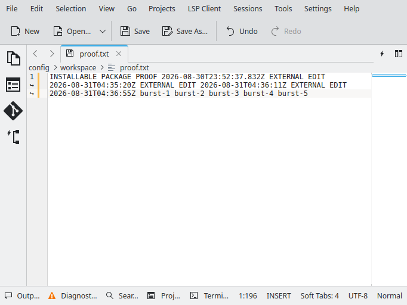

# The desk wakes the agent

Run `bash infra/webtop/signals/proof.sh` against the `infra/webtop` container. This is what it
proved on 2026-08-31.

## What is being claimed

An agent process installs `@mastra-cc/desktop` **from a tarball**, into a scratch project
outside this workspace. It asks the desk one question — where is the document, watch it for me —
and then **stops calling tools**. A human types into the document in KDE. The agent wakes up and
says what changed.

Nothing polls. Between the subscription and the wake the agent's process sends **zero** protocol
frames, and the daemon serves **zero** requests. The only thing that crosses the socket in that
window is the desk speaking first.

## The transcript

```
== packing the publishable packages ==
mastra-cc-desktop-0.1.0.tgz
mastra-cc-protocol-types-1.6.1.tgz
mastra-cc-transport-0.1.0.tgz

== installing into a scratch project outside the workspace ==
resolved from: /tmp/wake-the-agent-proof/node_modules/@mastra-cc/desktop/dist/mastra.mjs

== the daemon, with a receipt of every request it serves ==
daemon: websocket listening on 0.0.0.0:9977
container address: 172.20.0.2

== the agent asks once, then goes quiet ==
audit entries when the agent went quiet: 3

== a human types into Kate; nothing here opens a socket ==
typed at the desk: EXTERNAL EDIT 2026-08-31T04:36:55Z

tool-call: {"n":1,"name":"queryElements"}
tool-call: {"n":2,"name":"queryElements"}
tool-call: {"n":3,"name":"subscribeElement"}
agent-asked: {"text":"Element ID: el-935a7b1c4c7f, Subscription ID: sub-000001-246332","toolCalls":3}
SUBSCRIBED: {"callsSoFar":3,"messages":2}
IDLE: the agent is now calling nothing. Mutate the element from the desktop.
woken: {"text":"WOKEN desktop changed: text el-935a7b1c4c7f (watch sub-000001-246332)"}
frames-between-subscribe-and-wake: 0
OBSERVING: keep typing
observed-event-rate: {"events":6,"spanSeconds":10.61,"perSecond":0.57,"wakes":6}
{"proof":"green","framesBetween":0,"callsBeforeIdle":3,"woken":"WOKEN desktop changed: text el-935a7b1c4c7f (watch sub-000001-246332)"}
audit entries after the wake: 3 (daemon-side requests while the agent was quiet: 0)
PROOF: GREEN
```

The three tool calls before the subscription are the agent's own: it looked for the document,
looked again, and subscribed with `priority: high`. It chose those calls; nothing in the harness
names an element id or a subscription id.

## The two counts, measured independently

| Count | Where it comes from | Value |
|---|---|---|
| Frames the agent's process sent between subscribe and wake | a counter wrapped round every tool `execute` in the consumer process — the client is private to the `MastraCC` instance, so a frame cannot leave any other way | **0** |
| Requests the daemon answered in the same window | the daemon's own `--audit` log, on the other side of the socket, in another namespace | **0** (3 before, 3 after) |

The second number is the one that matters, because it is written by the process being talked to
rather than by the process making the claim.

## The mutation was made from the desktop

```
xdotool search --name 'proof.txt' | xargs xdotool windowactivate --sync
xdotool type ' EXTERNAL EDIT 2026-08-31T04:36:55Z'
```

No second protocol client exists anywhere in this proof — pin B5 still passes, and it now scans
`infra/`. That is what makes the attribution genuinely `external`: had the harness opened its own
dial and called `setValue`, the daemon would have called the change `self`-attributed for that
connection, `DesktopSignals` would have dropped it by default, and the agent would have slept
through it. The typing is the point.



## How fast a real desk actually talks

Five bursts typed two seconds apart produced **6 events in 10.6 seconds — 0.57 events per
second**, and 6 wakes. That is the measured number the throttle window is set against; it is not
a guess, and it is small because the daemon already collapses repeat changes upstream. A whole
typed sentence arrives as roughly one event, not one per keystroke.

Note the honest consequence: at that rate the default window does **not** suppress much. It is a
floor against a pathological element, not a rate limiter for ordinary typing. Notifications
persist as records (there is no `transient` on this path), so a chatty desk accumulates rows.

## Base-red

The same script, against a `@mastra-cc/desktop` built from the merge base `e9e193f`:

```
import { MastraCC } from "@mastra-cc/desktop/mastra";
         ^^^^^^^^
SyntaxError: The requested module '@mastra-cc/desktop/mastra' does not provide an export named 'MastraCC'
```

Before this work the installed package could be *asked*. It could not *tell*.

## What this does not prove

One agent, one instance, one socket, one thread. The multi-agent property — two agents cannot
confuse each other's attribution because they cannot share a connection — is true by
construction (ADR-0060) and is **not** exercised here. Neither is the multi-thread case: the
provider's target is fixed for its lifetime (ADR-0061).
